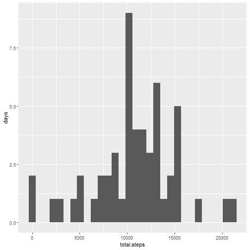
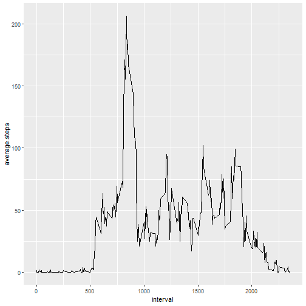
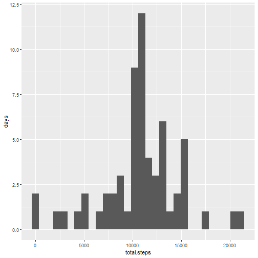
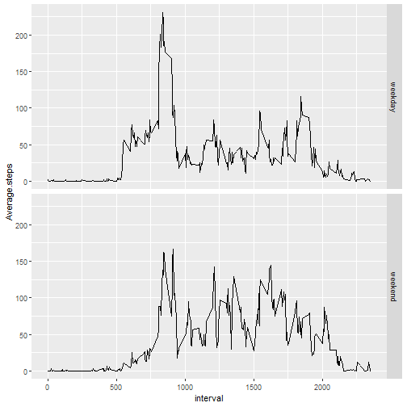

# Activity Monitoring Dataset
By: DicksonC  
Source: http://github.com/rdpeng/RepData_PeerAssessment1

### Importing the required library

```r
library(readr)
library(dplyr)
library(ggplot2)
library(lubridate)
library(lattice)
```

### Loading and preprocessing the data

```r
# Reading dataset
data <- read.csv(unz("activity.zip", "activity.csv"), na.strings = "NA")
# Formatting date column
data$date <- ymd(as.character(data$date))
summary(data)
```

```
##      steps             date               interval     
##  Min.   :  0.00   Min.   :2012-10-01   Min.   :   0.0  
##  1st Qu.:  0.00   1st Qu.:2012-10-16   1st Qu.: 588.8  
##  Median :  0.00   Median :2012-10-31   Median :1177.5  
##  Mean   : 37.38   Mean   :2012-10-31   Mean   :1177.5  
##  3rd Qu.: 12.00   3rd Qu.:2012-11-15   3rd Qu.:1766.2  
##  Max.   :806.00   Max.   :2012-11-30   Max.   :2355.0  
##  NA's   :2304
```

### What is mean total number of steps taken per day?

```r
# Grouping data by date and calculate sum
totalsteps <- data %>%
              select(date, steps) %>%
              group_by(date) %>%
              summarize(total.steps = sum(steps))
# Plotting histogram
with(totalsteps, qplot(total.steps, geom = "histogram", ylab = "days"))
```



```r
# Calculate mean and median of the total number of steps taken per day
summary <- summary(totalsteps)
noquote(summary[c(4, 3),2])
```

```
##                                 
## Mean   :10766   Median :10765
```

### What is the average daily activity pattern?

```r
# Grouping data by interval and calculate mean
avgsteps <- data %>%
            select(interval, steps) %>%
            group_by(interval) %>%
            summarize(average.steps = mean(steps, na.rm = TRUE))
# Plotting points
with(avgsteps, qplot(interval, average.steps, geom = "path"))
```



```r
# Maximum number of steps in 5-minute interval on average across the days
index <- which.max(avgsteps$average.steps)
as.integer(avgsteps[index, "interval"])
```

```
## [1] 835
```

### Imputing missing values

```r
# Total number of missing values in the dataset
sum(is.na(data))
```

```
## [1] 2304
```

```r
# Replacing missing values with mean by interval
cleandata <- data %>%
             group_by(interval) %>%
             mutate(average.steps = mean(steps, na.rm = TRUE)) %>%
             mutate(steps = ifelse(is.na(steps), average.steps, steps)) %>%
             select(steps, date)
# Checking if any missing values in the new dataset
sum(is.na(cleandata))
```

```
## [1] 0
```

```r
# Grouping cleandata by date and calculate sum
totalcleansteps <- cleandata %>%
                   select(date, steps) %>%
                   group_by(date) %>%
                   summarize(total.steps = sum(steps))
# Plotting histogram
with(totalcleansteps, qplot(total.steps, geom = "histogram", ylab = "days"))
```



```r
# Calculate mean and median of the total number of steps taken per day
cleansummary <- summary(totalcleansteps)
# Difference with missing values
data.frame(Data = c("With NAs", "Without NAs"), 
           Mean = c(parse_number(summary[4, 2]), parse_number(cleansummary[4, 2])),
           Median = c(parse_number(summary[3,2]), parse_number(cleansummary[3, 2])))
```

```
##          Data  Mean Median
## 1    With NAs 10766  10765
## 2 Without NAs 10766  10766
```

### Are there differences in activity patterns between weekdays and weekends?

```r
wdwe <- cleandata %>%
        # Creating new variable for weekdays/weekends in cleandata
        mutate(weekday.weekend = factor(ifelse(wday(date) %in% c(1,7), "weekend", "weekday"))) %>%
        # Grouping cleandata by weekdays/weekends and interval before calculate average
        group_by(weekday.weekend, interval) %>%
        summarize(Average.steps = mean(steps))
with(wdwe, qplot(interval, Average.steps, facets = weekday.weekend~., geom = "line"))
```




